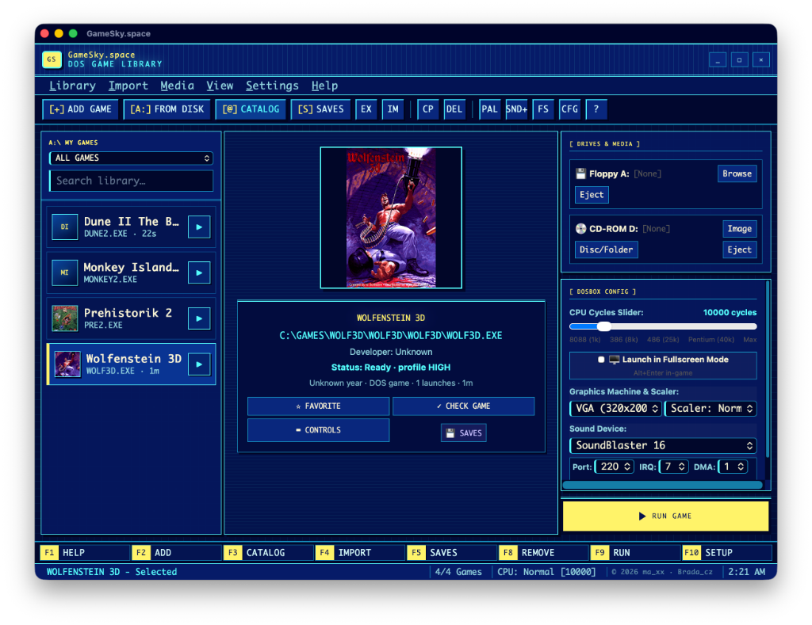

# 🕹️ GameSky.space

[-000000.svg?style=flat-square&logo=apple)](https://gamesky.space)
[](https://tauri.app)
[](LICENSE)
[](https://www.buymeacoffee.com/mariantomay)

> **Moderní retro herní pracovní stanice a správce DOSBoxu pro macOS.**  
> 100% přímé spouštění DOS her, chytrý Drive Bay, podpora Sound Blasteru 16 / Roland MT-32 a ochrana herních pozic bez nutnosti psaní příkazů do terminálu.

---



---

## 🌟 Klíčové vlastnosti / Key Features

- **⚡ 1-Click Přímé spouštění (Zero Terminal):** Konec ručního psaní `mount c ~/games/...` a ladění parametrů v terminálu. Dvojklik a hra se spustí v optimalizovaném prostředí.
- **💿 Virtuální Drive Bay:** Okamžité připojování ISO, CUE/BIN, DMG, IMG disket i lokálních složek Macu jako virtuálních DOS mechanik `C:\` a `D:\`.
- **🎛️ Hardwarový subsystém:**
  - Yamaha OPL3 FM syntéza (Sound Blaster 16)
  - Gravis UltraSound (GUS)
  - Roland MT-32 MIDI bridge přes macOS CoreAudio
  - PC Speaker emulace
- **🔒 Save Vault & Checkpointy:** Inteligentní sandboxové zálohování a rekurzivní správa složek zabraňující přepsání nebo ztrátě herních pozic při přeinstalacích.
- **📺 VGA Scaler Engine:** Režimy `normal2x`, `normal3x`, `advmame2x`, `hq2x` a automatická korekce poměru stran 4:3 pro moderní Retina a UltraWide displeje.
- **🌐 FreeDOS 1.4 Katalog:** 35 legálních, licenčně ověřených open-source balíčků s automatickou kontrolou kontrolních součtů CRC32.
- **🦀 Rust & Tauri v2 Core:** Bleskový start, minimální spotřeba paměti RAM a nativní binárka pro Apple Silicon (M1/M2/M3/M4) i procesory Intel.

---

## 🤝 Vítáme podporu a zapojení do vývoje! / Community & Contributions

Projekt **GameSky.space** je vyvíjen jako otevřený open-source nástroj pro všechny milovníky retro her na platformě Mac. **Velmi vítáme pomoc a nápady od komunity!**

Jak se můžete zapojit:
1. 🐛 **Hlášení chyb a nápadů:** Vytvořte [GitHub Issue](https://github.com/bradacz/gamesky.space/issues) s popisem chyby nebo návrhem nové funkce.
2. 🎮 **Testování herních profilů:** Pomozte nám otestovat a vyladit optimální cykly CPU pro vaše oblíbené DOS klasiky.
3. 💻 **Pull Requesty:** Vylepšení frontendového rozhraní, Rust backendu nebo zvukových profilů jsou srdečně vítána!
4. ☕ **Podpora vývoje:** Líbí se vám GameSky? Můžete autora pozvat na kávu přes [Buy Me A Coffee](https://www.buymeacoffee.com/mariantomay).

---

## 🚀 Vývojové spuštění / Development Setup

### Požadavky / Prerequisites
- Node.js 18+ a `npm`
- Rust 1.75+ a `cargo`
- macOS 11.0+ (Big Sur, Monterey, Ventura, Sonoma, Sequoia)

### Instalace a start / Installation & Run

```bash
# 1. Klonování repozitáře
git clone https://github.com/bradacz/gamesky.space.git
cd gamesky.space

# 2. Instalace závislostí
npm install

# 3. Spuštění vývojového webu (Vite)
npm run dev

# 4. Spuštění plné nativní desktopové aplikace (Tauri v2 + Rust)
npm run tauri dev
```

---

## 🛠️ Sestavení a testy / Build & Checks

```bash
# Kontrola TypeScriptu a sestavení webových assetů
npm run build

# Testy Rust jádra
cargo test --manifest-path src-tauri/Cargo.toml

# Linter Rustu
cargo clippy --manifest-path src-tauri/Cargo.toml --all-targets -- -D warnings
```

---

## 📦 Podepsaný macOS Release (DMG)

Release skript vytváří Universal macOS aplikaci a DMG pro Apple Silicon i Intel s podpisem Developer ID:

```bash
npm run release:macos
```

---

## 📄 Licence / License

Tento projekt je licencován pod **[MIT Licencí](LICENSE)**.  
Emulační vrstva využívá a spolupracuje s open-source projekty **DOSBox**, **DOSBox-Staging** a **DOSBox-X** (licencováno pod GNU GPLv2). Všechny názvy her a registrované ochranné známky náleží jejich původním vlastníkům.

---

© 1995–2026 **GameSky.space** · Vyvinuto s ❤️ v Rustu a Reactu pro macOS.
