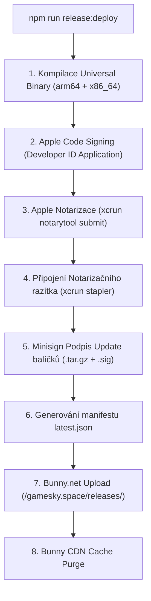

# 📦 GameSky.space — Příručka pro Podepisování, Verzování a Publikování

Tento dokument slouží jako kompletní referenční příručka pro proces sestavení podepsané macOS aplikace, její notarizaci u Apple, generování auto-update balíčků a automatické nasazení na **Bunny.net CDN**.

---

## 🏛️ Architektura a Prvky Distribuce



---

## ⚙️ 1. Příprava a Konfigurace Prostředí

Všechny privátní přihlašovací údaje jsou uloženy v lokálním souboru `.env.release` (který je ignorován Gitem a nesmí být nikdy nahrán do repozitáře).

### Struktura `.env.release`:
```env
# 1. Apple Developer identita a Notarizace
APPLE_SIGNING_IDENTITY="D47A72C737C511C2340D8BD1B4B147B2069544F9"
APPLE_TEAM_ID="4RY8J45UR3"
APPLE_ID="vas-apple-id@email.com"
APPLE_PASSWORD="heslo-pro-aplikaci-z-appleid.apple.com"

# 2. Minisign klíče pro Auto-Updater (vygenerované přes npm run release:keys)
TAURI_SIGNING_PRIVATE_KEY="/Users/ma_xx/development/dosbox/.tauri-keys/updater.key"
TAURI_SIGNING_PRIVATE_KEY_PASSWORD=""
GAMESKY_UPDATER_PUBKEY="dW50cnVzdGVkIGNvbW1lbnQ6IG1pbmlzaWduIHB1YmxpYyBrZXk6IDcwRkFBNUI2MjNGM0VFNjYKUldSbTd2TWp0cVg2Y0JhU1ZJRFFabWsxUW1XTGR2ekNmMkowdmFRR1hyTDQvOVBLejJPaUY1WnMK"

# 3. Bunny.net Storage & CDN (Oddělený adresář projektu)
BUNNY_STORAGE_ZONE_NAME="gamesky-storage"
BUNNY_STORAGE_PATH="gamesky.space"
BUNNY_STORAGE_REGION="de"
BUNNY_STORAGE_ACCESS_KEY="heslo-z-bunny-storage-panelu"
BUNNY_CDN_BASE_URL="https://game-sky-space.b-cdn.net"
BUNNY_API_KEY="" # Volitelný Account API klíč pro automatický Purge Cache
```

---

## 🚀 2. Krok za Krokem: Jak vydat Novou Verzi

### Krok 1: Zvýšení čísla verze (SemVer)
Otevřete `src-tauri/tauri.conf.json` a `package.json` a zvyšte číslo verze (např. z `1.0.0` na `1.0.1`):
```json
{
  "version": "1.0.1"
}
```

### Krok 2: Spuštění celého release procesu jedním příkazem
V kořenovém adresáři projektu spusťte:
```bash
npm run release:deploy
```

Tento příkaz provede automaticky celou sekvenci:
1. Zkontroluje přítomnost Rust cílů (`aarch64-apple-darwin` a `x86_64-apple-darwin`).
2. Sestaví frontend (`dist/app.html`) a zkompiluje Rust Universal Binary.
3. Podepíše binárku i `.app` certifikátem `Developer ID Application: Localio Labs s.r.o.`.
4. Zabalí a podepíše `GameSky.space_X.X.X_universal.dmg`.
5. Odešle balíček na servery Apple k notarizaci (`xcrun notarytool`) a počká na schválení.
6. Přilepí notarizační razítko k DMG i .app balíčku (`xcrun stapler`).
7. Ověří platnost pro macOS Gatekeeper (`spctl --assess`).
8. Zabalí a Minisignem podepíše update archiv `GameSky.space.app.tar.gz` a `.sig`.
9. Vygeneruje aktuální manifest `latest.json`.
10. Nahraje všechny soubory na Bunny.net do složky `/gamesky.space/releases/`.
11. Provede Purge Cache na CDN pro `latest.json` a `GameSky.space-latest.dmg`.

---

## 🔍 3. Samostatné dílčí příkazy

Pokud chcete provést jednotlivé kroky odděleně:

| Příkaz | Popis |
| :--- | :--- |
| `npm run release:keys` | Vygeneruje nový pár Minisign klíčů do `.tauri-keys/` (provádí se pouze jednou). |
| `npm run release:macos` | Pouze sestaví, podepíše, znotarizuje a ověří DMG balíček lokálně. |
| `npm run release:verify` | Ověří Gatekeeper validitu a notarizaci existujícího `.app` a `.dmg`. |
| `npm run release:bunny` | Pouze nahraje existující sestavené balíčky na Bunny.net CDN a aktualizuje `latest.json`. |
| `npm run release:deploy` | Kompletní all-in-one proces: Build ➔ Sign ➔ Notarize ➔ Bunny Upload. |

---

## 🌐 4. Produkční Endpointy na Bunny.net CDN

* **Nejnovější DMG pro stažení (Permanent Link):**  
  `https://game-sky-space.b-cdn.net/gamesky.space/releases/GameSky.space-latest.dmg`
* **Verzovaný DMG instalátor:**  
  `https://game-sky-space.b-cdn.net/gamesky.space/releases/GameSky.space_1.0.0_universal.dmg`
* **Auto-Updater Manifest pro aplikaci:**  
  `https://game-sky-space.b-cdn.net/gamesky.space/releases/latest.json`

---

## 🔒 5. Bezpečnostní zásady
1. **Nikdy necommitujte `.env.release` ani složku `.tauri-keys/` do Gitu** (jsou automaticky chráněny v `.gitignore`).
2. Privátní klíč `.tauri-keys/updater.key` si zálohujte na bezpečné místo (např. do správce hesel). Pokud jej ztratíte, nebude možné vydávat automatické aktualizace pro stávající uživatele bez změny veřejného klíče.
